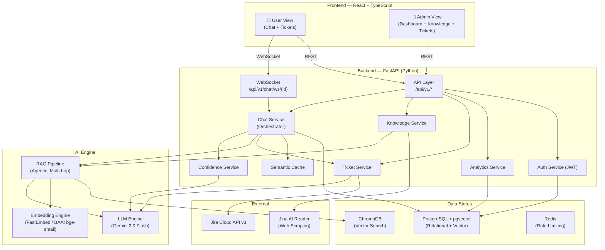
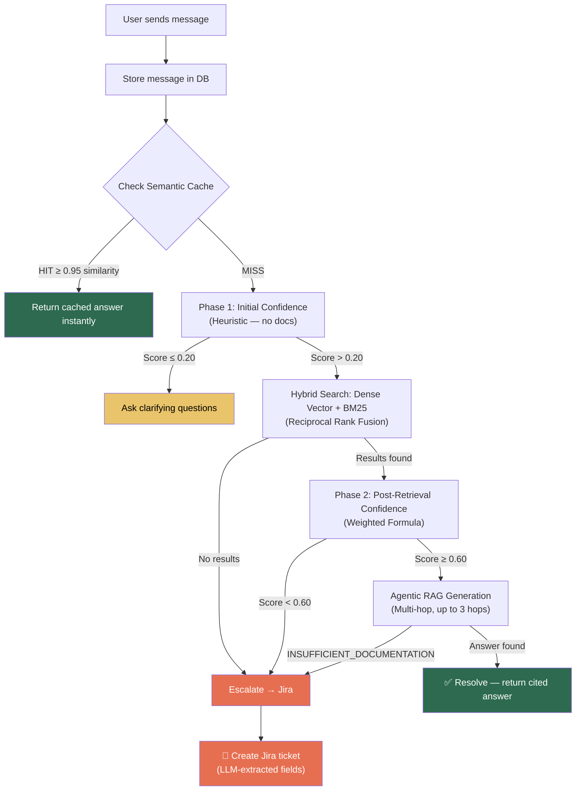
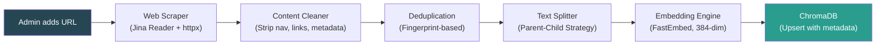
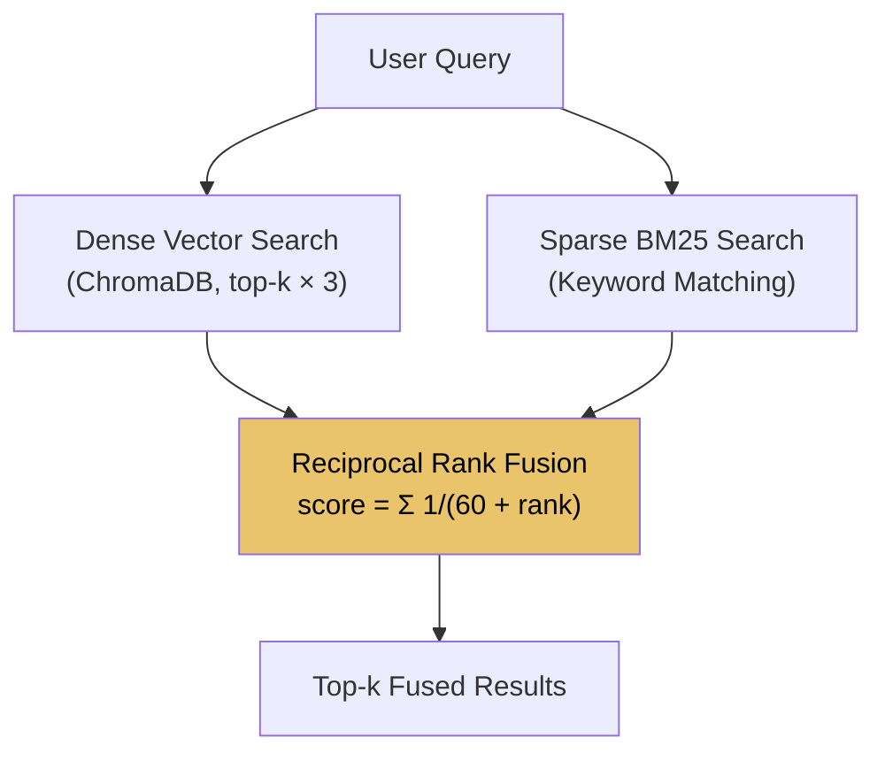
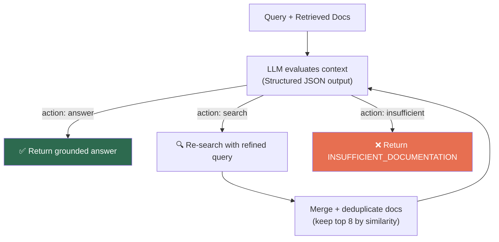
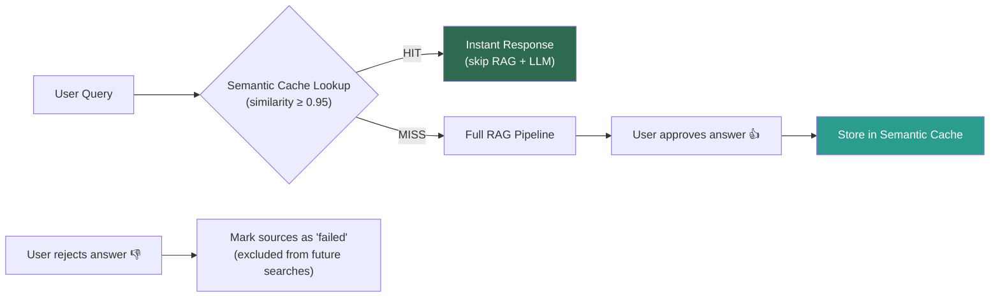
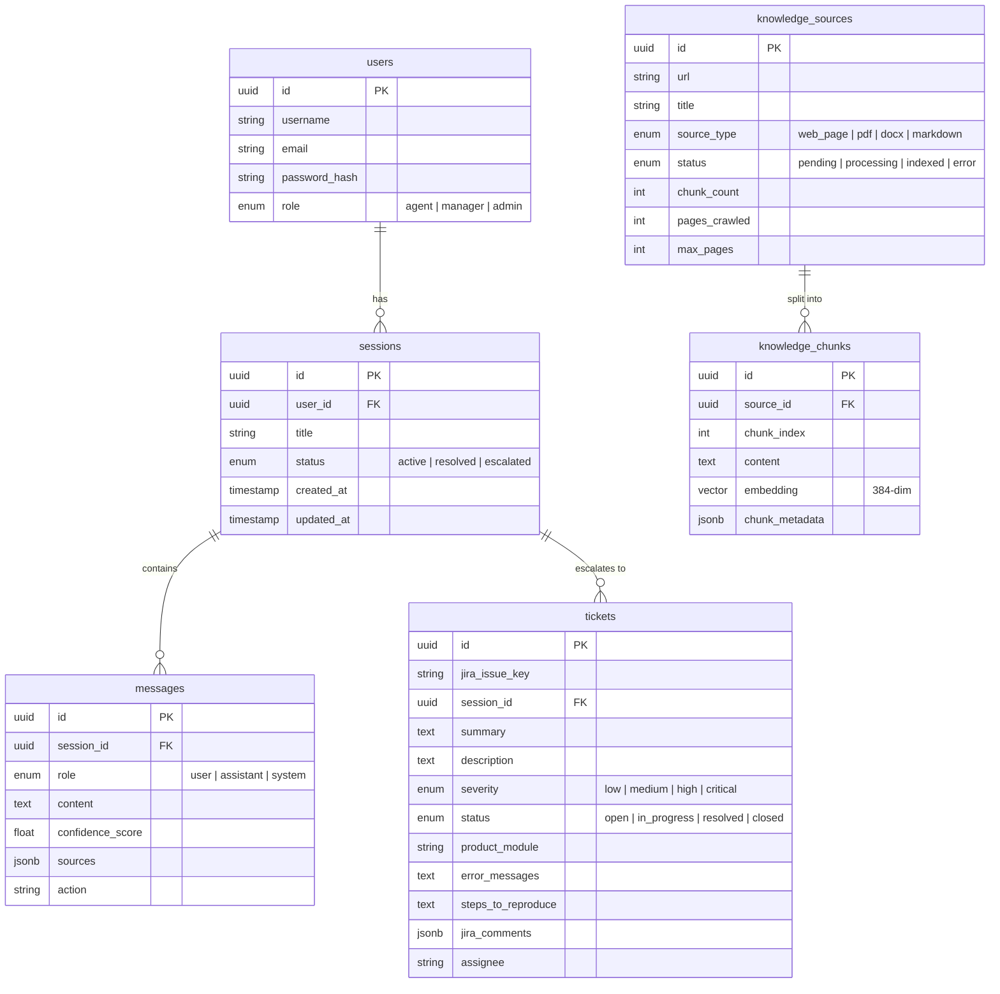
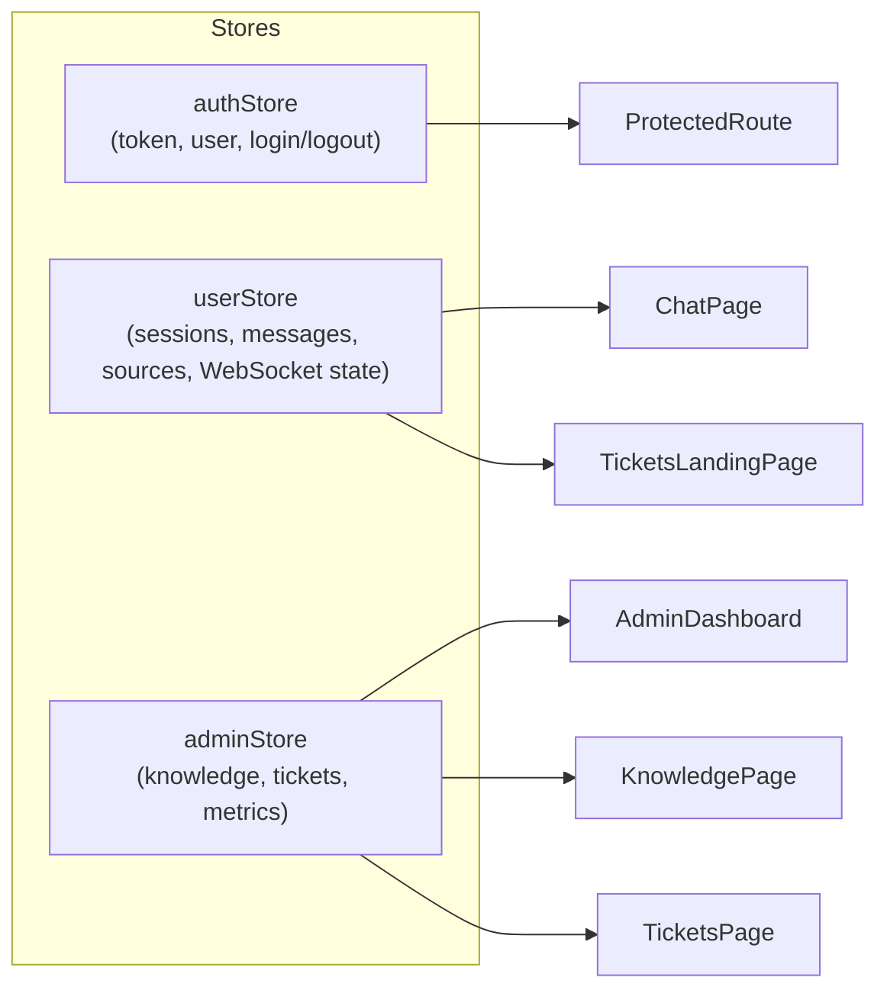
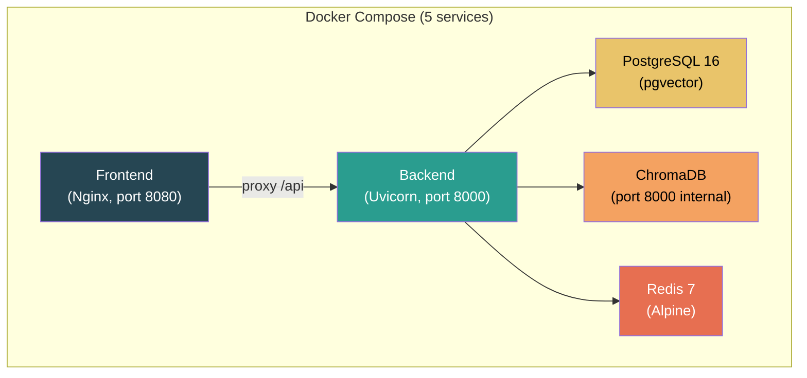

# EscalateAI — High-Level Architecture Overview

> **An AI-powered L2 Support Copilot that resolves customer issues autonomously using RAG-based document retrieval and intelligently escalates to human agents via Jira when it can't.**

---

## 1. What is EscalateAI?

EscalateAI is an **enterprise-grade, AI-first customer support platform** that acts as an intelligent L2 support agent. It ingests a company's technical documentation, and when a customer asks a question, it:

1. **Searches** the ingested knowledge base using hybrid retrieval (vector + keyword).
2. **Generates** a grounded, cited answer strictly from documentation.
3. **Evaluates confidence** using a multi-factor scoring formula.
4. **Decides** whether to resolve, ask clarifying questions, or escalate.
5. **Escalates** automatically to Jira with a fully structured ticket when it can't resolve.

The system features a **dual-view architecture**: a **User View** (chat interface for support queries) and an **Admin View** (dashboard for knowledge management, ticket oversight, and analytics).

---

## 2. System Architecture



---

## 3. Core Decision Pipeline

The heart of EscalateAI is a **confidence-driven decision pipeline** that processes every user message:



### Confidence Formula (Post-Retrieval)

```
confidence = (0.40 × retrieval_score) + (0.35 × relevance_score) + (0.25 × completeness_score)
```

| Factor | Weight | How it's calculated |
|---|---|---|
| **Retrieval Score** | 40% | Average cosine similarity of top-k retrieved chunks |
| **Relevance Score** | 35% | LLM-judged relevance of the top document (1–5 scale) |
| **Completeness Score** | 25% | Heuristic: prose density, sentence structure of chunks |

---

## 4. Technology Stack

### Backend

| Layer | Technology | Purpose |
|---|---|---|
| **Framework** | FastAPI (Python 3.11+) | Async REST + WebSocket API |
| **Database** | PostgreSQL 16 + pgvector | Relational data + vector embeddings |
| **Vector DB** | ChromaDB | Document chunk retrieval + semantic cache |
| **ORM** | SQLAlchemy 2.0 (Async) | Database access with modern `Mapped` syntax |
| **LLM** | Google Gemini 2.0 Flash (via LangChain) | Response generation, confidence eval, ticket extraction |
| **Embeddings** | FastEmbed (BAAI/bge-small-en-v1.5) | On-device, no API key needed, 384-dim vectors |
| **Web Scraping** | Jina AI Reader + httpx + BeautifulSoup | Documentation ingestion from any website |
| **Auth** | JWT (python-jose) + bcrypt | Token-based authentication |
| **Caching** | Redis (rate limiting) + ChromaDB (semantic cache) | Performance & cost optimization |
| **Retry Logic** | tenacity | Exponential backoff on LLM & Jira API calls |

### Frontend

| Layer | Technology | Purpose |
|---|---|---|
| **Framework** | React 18 + TypeScript | Type-safe UI components |
| **Bundler** | Vite | Fast dev server and builds |
| **State** | Zustand | Lightweight global state management |
| **Styling** | Tailwind CSS + Framer Motion | Responsive design + animations |
| **Real-time** | Native WebSocket | Streaming chat responses |
| **HTTP** | Axios | REST API calls with JWT interceptor |
| **Routing** | React Router DOM | Client-side navigation |

### Infrastructure

| Component | Technology | Purpose |
|---|---|---|
| **Containerization** | Docker + Docker Compose | 5-service orchestration |
| **CI/CD** | GitHub Actions | Automated testing |
| **Deployment** | AWS EC2 | Cloud hosting |

---

## 5. Knowledge Ingestion Pipeline

Admins add documentation URLs through the dashboard. The system crawls, cleans, chunks, embeds, and indexes the content — all asynchronously.



### Key Design Decisions

- **Parent-Child Chunking**: Small child chunks (500 chars) are embedded for precise retrieval, but the LLM receives the larger parent chunk (2000 chars) for better context.
- **Quality Filtering**: Chunks are rejected if they're mostly class listings, navigation menus, or link dumps (prose ratio < 20%).
- **Deduplication**: Near-duplicate pages are fingerprinted (head + tail + length bucket) and removed before chunking.
- **Async Background Tasks**: Ingestion runs via FastAPI `BackgroundTasks` — the API returns `202 Accepted` immediately.
- **Progress Tracking**: The crawler updates `pages_crawled` count in the DB as it goes, so the admin sees real-time progress.

---

## 6. Hybrid Retrieval System

EscalateAI uses **Reciprocal Rank Fusion (RRF)** to combine two retrieval signals:



| Retrieval Type | Strength | Example Query |
|---|---|---|
| **Dense (Vector)** | Semantic similarity, paraphrasing | _"How do I set up SSO?"_ matches _"Single Sign-On configuration guide"_ |
| **Sparse (BM25)** | Exact keyword match, technical terms | _"NullPointerException in PaymentGateway"_ matches exact class names |
| **RRF Fusion** | Best of both worlds | Combines semantic understanding with keyword precision |

---

## 7. Agentic RAG Generation

The RAG engine doesn't just retrieve and generate — it **reasons** about whether it has enough information:



- Up to **3 hops** of iterative search-and-evaluate.
- The LLM is instructed to **never use general knowledge** — answers must come strictly from the retrieved documentation.
- A `Domain Scoping` rule prevents the LLM from hallucinating answers when docs have zero topic overlap with the query.

---

## 8. Semantic Caching

Approved answers are cached in a dedicated ChromaDB collection for instant retrieval:



**Two-stage cache lookup:**
1. **Stage 1**: Semantic similarity check on the full query embedding.
2. **Stage 2**: Regex-based diagnostic signature extraction (e.g., `NullPointerException in PaymentGateway.loadApiKey line 73`) for deterministic cache matching on log-heavy queries.

---

## 9. Jira Integration

When EscalateAI can't resolve a query, it creates a rich Jira ticket automatically:

| Ticket Field | Source |
|---|---|
| Summary | LLM-extracted from conversation |
| Description | Conversation context + error details |
| Severity → Priority | Mapped: `critical` → `Highest`, `high` → `High`, etc. |
| Product Module | LLM-extracted |
| Environment | LLM-extracted |
| Error Messages | LLM-extracted |
| Steps to Reproduce | LLM-extracted |
| Labels | `copilot-escalation`, `session:{id}` |

**Bi-directional sync**: The admin dashboard pulls updated status, assignee, priority, and comments back from Jira.

**Mock fallback**: If `JIRA_API_TOKEN` is not set, the system generates fake issue keys (e.g., `SUP-A1B2C3`) so demos and development are never blocked.

---

## 10. Database Schema



---

## 11. Frontend Architecture

### Routing & Access Control

| Route | View | Role Required |
|---|---|---|
| `/login` | Login Page | Public |
| `/` , `/tickets` | Tickets Landing | Authenticated |
| `/chat/:sessionId` | Chat Interface | Authenticated |
| `/admin` | Analytics Dashboard | Admin |
| `/admin/knowledge` | Knowledge Management | Admin |
| `/admin/tickets` | Ticket Oversight | Admin |

### State Management (Zustand)



### Real-time Streaming

The chat interface uses a **singleton WebSocket** pattern:

1. Client connects to `ws://host/api/v1/chat/ws/{sessionId}?token=JWT`.
2. Client sends `{"type": "message", "content": "...", "knowledge_sources": [...]}`.
3. Server streams back `start` → `chunk` (×N) → `final` events.
4. Auto-reconnect with **exponential backoff** (up to 5 attempts).

---

## 12. Attachment Processing

Users can attach files (screenshots, logs, PDFs, videos) to their support queries. The `AttachmentParser` extracts diagnostic evidence:

| File Type | Processing Method |
|---|---|
| **Images** | Gemini multimodal vision — extracts visible errors, screen names, UI steps |
| **Videos** | Gemini multimodal — extracts key frames and error sequences |
| **Logs / Text** | Regex heuristics + LLM summarization — extracts exceptions, stack traces |
| **PDFs** | `pypdf` text extraction + LLM summarization |

The parsed evidence is injected into the RAG query as `<attached_evidence>` blocks, giving the LLM full diagnostic context alongside documentation.

---

## 13. Deployment Architecture



- **Health checks** on all services with retry logic.
- **Persistent volumes** for PostgreSQL and ChromaDB data.
- **CORS** configured for frontend origins.
- **Environment variables** injected via `.env` files.

---

## 14. Security & Reliability

| Feature | Implementation |
|---|---|
| **Authentication** | JWT tokens (HS256, 24h expiry) with bcrypt password hashing |
| **Authorization** | Role-based access (agent, manager, admin) with route guards |
| **WebSocket Auth** | Token passed via query param, validated before `accept()` |
| **Rate Limiting** | slowapi (100 req/min default) |
| **Error Handling** | Centralized exception handlers for HTTP, validation, DB, and uncaught errors |
| **Retry Logic** | Exponential backoff (tenacity) on all LLM and Jira API calls |
| **Anti-Pollution** | Generated/fallback answers are never saved back into ChromaDB |
| **Input Validation** | Pydantic models on all request/response boundaries |
| **Secrets Management** | All credentials via `.env` files, never committed |

---

## 15. Key Differentiators

1. **Confidence-Driven Escalation** — Not a simple chatbot. The system mathematically evaluates whether it can answer before responding.
2. **Agentic Multi-Hop RAG** — The AI iteratively searches for missing information across up to 3 hops before giving up.
3. **Hybrid Retrieval (RRF)** — Combines semantic understanding with keyword precision for superior search quality.
4. **Parent-Child Chunking** — Small chunks for precise retrieval, large chunks for rich LLM context.
5. **Feedback-Driven Caching** — Only user-approved answers enter the semantic cache. Rejected answers are excluded from future searches.
6. **Multimodal Evidence Intake** — Screenshots, logs, and PDFs are automatically parsed for diagnostic evidence.
7. **Zero-Config Demo Mode** — Jira mock fallback ensures the full pipeline works without external credentials.
8. **On-Device Embeddings** — FastEmbed runs locally — no API calls, no rate limits, no cost per embedding.
